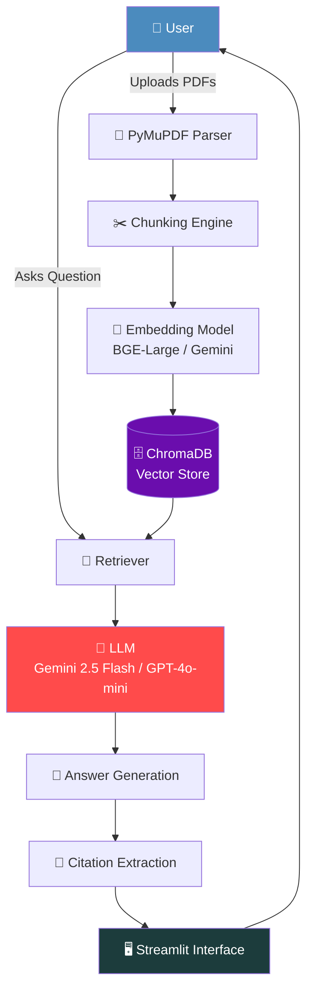

<div align="center">

# 🛰️ SpaceDocs AI

### *Talk to NASA, ISRO & Space Research documents — in plain English.*

An AI-powered **Retrieval-Augmented Generation (RAG)** system that turns dense aerospace papers, mission reports, and engineering manuals into an interactive, conversational knowledge base.

[](https://www.python.org/)
[](https://www.langchain.com/)
[](https://streamlit.io/)
[](https://www.trychroma.com/)
[](#-license)
[](#)
[](#)

</div>

<br/>

> **Internship Track:** I2 – Document Q&A (RAG) &nbsp;|&nbsp; **Duration:** 5 Weeks &nbsp;|&nbsp; **Type:** Applied Machine Learning

---

## 🎬 Demo

<table>
<tr>
<td align="center" width="50%">

**🌐 Live App**

[](https://your-app-url.streamlit.app)

*`<insert deployed Streamlit Cloud URL here>`*

</td>
<td align="center" width="50%">

**🎥 Walkthrough Video**

[](https://www.loom.com/share/your-video-id)

*`<insert Loom video link here>`*

</td>
</tr>
</table>

---

## 🧩 Problem Statement

> Scientific and aerospace literature — NASA technical papers, ISRO mission reports, satellite engineering manuals — is **information-dense, jargon-heavy, and time-consuming to navigate**. Researchers and students often spend more time *searching* for an answer than *understanding* it.

**SpaceDocs AI** solves this by letting users upload space-domain PDFs and ask natural-language questions, receiving grounded, citation-backed answers instead of having to manually skim hundreds of pages.

### 🎯 Motivation

- Space research documents are scattered across PDFs, reports, and manuals with inconsistent structure.
- Keyword search (Ctrl+F) fails when the user doesn't know the exact terminology used in the source.
- Generic LLMs hallucinate facts when asked about niche aerospace content they were never reliably trained on.
- There is no lightweight, open, conversational interface purpose-built for **space & aerospace document exploration**.

### ✅ Objectives

| # | Objective |
|---|-----------|
| 1 | Build a robust ingestion pipeline that parses multi-format space-domain PDFs |
| 2 | Implement semantic chunking + embedding for accurate retrieval |
| 3 | Ground every LLM answer in retrieved context with **visible source citations** |
| 4 | Provide guardrails so the system says *"I don't know"* instead of hallucinating |
| 5 | Add value-added features — summarization, quizzes, document comparison |
| 6 | Evaluate the pipeline quantitatively using **RAGAS** metrics |
| 7 | Ship a publicly deployed, demo-ready Streamlit application |

---

## ✨ Features

<table>
<tr><td>

- 📄 Upload one or multiple PDFs
- 🔍 Automatic PDF parsing (PyMuPDF)
- ✂️ Intelligent semantic chunking
- 🧬 Embedding generation
- 🗄️ Vector database storage (ChromaDB)
- 🎯 Semantic retrieval (top-k similarity)

</td><td>

- 💬 Conversational Question Answering
- 📌 Source citations for every answer
- 🕓 Persistent conversation history
- 📊 Confidence scores per response
- 📝 Automatic document summaries
- 🧠 Quiz generation from document content

</td><td>

- 🔁 Compare two documents side-by-side
- 🚧 Out-of-domain guardrails
- 🤷 Graceful "I don't know" handling
- 🖥️ Clean, responsive Streamlit UI
- 📚 Multi-document knowledge base
- ⚡ Fast vector-based retrieval

</td></tr>
</table>

---

## 🛠️ Tech Stack

| Layer | Technology | Purpose |
|---|---|---|
| 🐍 **Language** | Python 3.10+ | Core application logic |
| 🎨 **Frontend** | Streamlit | Interactive chat UI |
| 🔗 **Orchestration** | LangChain | RAG pipeline & chaining |
| 🗄️ **Vector Database** | ChromaDB | Embedding storage & similarity search |
| 🧬 **Embeddings** | BAAI BGE-Large / Gemini Embeddings | Text → vector representation |
| 🤖 **LLM** | Gemini 2.5 Flash / GPT-4o-mini | Answer generation & reasoning |
| 📄 **PDF Processing** | PyMuPDF (fitz) | Text & layout extraction |
| 📈 **Evaluation** | RAGAS | Faithfulness, relevancy, precision metrics |
| ☁️ **Deployment** | Streamlit Cloud | Public hosting |
| 🔧 **Version Control** | Git + GitHub | Source control & collaboration |

---

## 🏗️ Architecture



<details>
<summary><b>📋 Step-by-step flow</b></summary>

1. **Upload** — User uploads one or more PDFs (NASA/ISRO reports, manuals, papers).
2. **Parsing** — PyMuPDF extracts raw text while preserving structural cues.
3. **Chunking** — Text is split into overlapping, semantically coherent chunks.
4. **Embedding** — Each chunk is converted into a dense vector representation.
5. **Storage** — Vectors are persisted in ChromaDB along with metadata (source, page).
6. **Retrieval** — User query is embedded and matched against stored vectors (top-k).
7. **Generation** — Retrieved context + query is passed to the LLM for a grounded answer.
8. **Citation** — Source chunks/pages used are extracted and displayed.
9. **Display** — Final answer, citations, and confidence score render in the Streamlit UI.

</details>

---

## 📁 Folder Structure

```text
spacedocs-ai/
│
├── app.py                      # Streamlit entry point
├── requirements.txt            # Python dependencies
├── .env.example                # Sample environment variables
│
├── src/
│   ├── ingestion/
│   │   ├── pdf_loader.py       # PyMuPDF-based PDF parsing
│   │   └── chunker.py          # Text splitting / chunking logic
│   │
│   ├── embeddings/
│   │   └── embedder.py         # Embedding model wrapper (BGE / Gemini)
│   │
│   ├── vectorstore/
│   │   └── chroma_client.py    # ChromaDB initialization & queries
│   │
│   ├── rag/
│   │   ├── retriever.py        # Semantic retrieval logic
│   │   ├── chain.py            # LangChain RAG pipeline
│   │   └── guardrails.py       # Out-of-domain / "I don't know" handling
│   │
│   ├── features/
│   │   ├── summarizer.py       # Document summarization
│   │   ├── quiz_generator.py   # Quiz generation module
│   │   └── doc_comparator.py   # Compare two documents feature
│   │
│   └── evaluation/
│       └── ragas_eval.py       # RAGAS-based pipeline evaluation
│
├── data/
│   ├── raw_pdfs/                # Source PDF corpus (NASA, ISRO, etc.)
│   └── chroma_db/                # Persisted vector store
│
├── notebooks/
│   └── experiments.ipynb       # Prototyping & evaluation notebooks
│
└── docs/
    └── architecture.png        # Architecture diagram export
```

---

## ⚙️ Installation Guide

### 📋 Prerequisites

| Requirement | Version / Notes |
|---|---|
| Python | 3.10 or higher |
| pip | Latest |
| Git | Any recent version |
| API Key | Gemini API key **or** OpenAI API key |
| RAM | 8 GB+ recommended for local embedding models |

### 🔑 Environment Variables

Create a `.env` file in the project root:

```env
# Choose ONE LLM provider
GOOGLE_API_KEY=your_gemini_api_key_here
OPENAI_API_KEY=your_openai_api_key_here

# Embedding configuration
EMBEDDING_PROVIDER=gemini          # or "bge"
EMBEDDING_MODEL=models/embedding-001

# Vector store
CHROMA_PERSIST_DIR=./data/chroma_db

# App settings
LLM_MODEL=gemini-2.5-flash         # or "gpt-4o-mini"
TOP_K_RETRIEVAL=5
```

> ⚠️ **Never commit your `.env` file.** It is already included in `.gitignore`.

### 🚀 Setup Instructions

```bash
# 1️⃣ Clone the repository
git clone https://github.com/<your-username>/spacedocs-ai.git
cd spacedocs-ai

# 2️⃣ Create a virtual environment
python -m venv venv
source venv/bin/activate      # On Windows: venv\Scripts\activate

# 3️⃣ Install dependencies
pip install -r requirements.txt

# 4️⃣ Configure environment variables
cp .env.example .env
# then edit .env with your API keys
```

### ▶️ Running Locally

```bash
streamlit run app.py
```

The app will be available at:

```text
http://localhost:8501
```

### 🌩️ Useful Streamlit Commands

```bash
# Run on a specific port
streamlit run app.py --server.port 8502

# Clear Streamlit cache
streamlit cache clear

# Run headless (for servers)
streamlit run app.py --server.headless true
```

---

## 🧠 How It Works

### 🔍 How Retrieval Works

> Retrieval converts a natural-language question into a search over the vector space, returning the **most semantically similar** chunks — not just keyword matches.

1. The user's query is embedded using the same model used for document chunks.
2. ChromaDB performs a similarity search (cosine/L2) against stored vectors.
3. The top-k most relevant chunks (with metadata) are returned to the pipeline.
4. Retrieved chunks are ranked and passed to the LLM as grounding context.

### ✂️ How Chunking Works

> Long documents are split into smaller, overlapping segments so each chunk preserves enough local context to be meaningfully embedded and retrieved.

| Parameter | Typical Value | Purpose |
|---|---|---|
| Chunk size | 800–1000 tokens | Balances context vs. specificity |
| Chunk overlap | 100–150 tokens | Prevents losing context at boundaries |
| Splitter | Recursive character/token splitter | Respects paragraph/sentence boundaries |

### 🧬 How Embeddings Work

> Embeddings map text into a high-dimensional vector space where **semantically similar text lands close together** — enabling meaning-based search rather than exact-keyword search.

- **BAAI BGE-Large** — open-source, high-performance embedding model, runs locally/offline.
- **Gemini Embeddings** — cloud-based, low-latency, tightly integrated with Gemini LLMs.

### 🗄️ Vector Database Explanation

> **ChromaDB** stores each chunk's embedding alongside metadata (source file, page number, chunk index), enabling fast approximate nearest-neighbor search at query time and persistent storage across sessions.

```python
# Simplified ChromaDB usage
collection.add(
    documents=[chunk_text],
    embeddings=[embedding_vector],
    metadatas=[{"source": "chandrayaan3_report.pdf", "page": 12}],
    ids=[chunk_id]
)

results = collection.query(
    query_embeddings=[query_vector],
    n_results=5
)
```

### 🔄 RAG Pipeline Explanation

> RAG combines **retrieval** (finding relevant facts) with **generation** (an LLM composing an answer), ensuring responses are grounded in real document content rather than the model's parametric memory alone.

```text
Question → Embed → Retrieve Top-K Chunks → Construct Prompt
        → LLM Generates Answer → Extract Citations → Return to User
```

This significantly reduces hallucination and makes every answer **traceable back to a source document and page**.

---

## 📏 Evaluation Methodology

The pipeline is evaluated using **[RAGAS](https://github.com/explodinggradients/ragas)**, an open-source framework purpose-built for RAG evaluation.

| Metric | What It Measures |
|---|---|
| **Faithfulness** | Does the answer stay true to the retrieved context (no hallucination)? |
| **Answer Relevancy** | Is the answer actually relevant to the question asked? |
| **Context Precision** | Are the retrieved chunks relevant to the query? |
| **Context Recall** | Did retrieval surface all the necessary information? |

> 💡 **Callout:** A held-out evaluation set of question–answer pairs (derived from the NASA/ISRO corpus) is used to benchmark the pipeline before and after tuning chunk size, embedding model, and retrieval `k`.

---

## 💬 Sample Questions

Try asking SpaceDocs AI things like:

```text
🚀 "What is Chandrayaan-3?"
🛰️ "Explain PSLV architecture"
🌕 "Compare Artemis and Chandrayaan"
📡 "What are the applications of CubeSats?"
🔬 "Summarize the satellite engineering manual I uploaded"
❓ "What does this document say about thermal protection systems?"
```

---

## 🧪 Mini Extension — Document Comparison Module

> A standout feature: SpaceDocs AI can **compare two uploaded documents side-by-side** (e.g., *Chandrayaan-3* vs. *Artemis* mission reports) and generate a structured comparison covering objectives, technology, timeline, and outcomes.

```text
Input:  Document A (Chandrayaan-3 Report) + Document B (Artemis Mission Report)
Output: ┌─────────────────────┬──────────────────┬──────────────────┐
        │ Aspect              │ Chandrayaan-3     │ Artemis           │
        ├─────────────────────┼──────────────────┼──────────────────┤
        │ Launch Vehicle      │ LVM3              │ SLS                │
        │ Target               │ Lunar South Pole  │ Lunar South Pole   │
        │ Crewed               │ No                │ Yes (later phases) │
        └─────────────────────┴──────────────────┴──────────────────┘
```

---

## ⚠️ Known Limitations

- 📄 Parsing accuracy depends on PDF quality (scanned/image-only PDFs need OCR, not yet integrated).
- 🌐 Currently optimized for English-language documents only.
- 🧮 Large corpora (100+ PDFs) may require migrating from local ChromaDB to a managed vector store.
- 🐢 Embedding generation for very large PDFs can be slow on CPU-only environments.
- 🤖 LLM-based answers, while grounded, can still occasionally over-generalize on ambiguous queries.

---

## 🔭 Future Improvements

- [ ] OCR support for scanned mission documents
- [ ] Multi-lingual support (Hindi, regional ISRO publications)
- [ ] Hybrid search (keyword + semantic) for improved recall
- [ ] Reranking layer (e.g., Cohere Rerank / cross-encoder)
- [ ] User authentication & per-user document libraries
- [ ] Caching layer for repeated queries
- [ ] Voice-based query interface

### 🛤️ Third-Year Extension Roadmap

| Phase | Milestone |
|---|---|
| **Phase 1** | Migrate to a scalable managed vector DB (Pinecone / Qdrant Cloud) |
| **Phase 2** | Fine-tune a domain-specific embedding model on aerospace corpora |
| **Phase 3** | Add agentic capabilities — multi-step research agent over the document set |
| **Phase 4** | Build a public API layer for third-party integration |
| **Phase 5** | Expand corpus with ESA, JAXA, and academic aerospace journals |
| **Phase 6** | Add analytics dashboard tracking query trends and document coverage gaps |

---

## 📌 Resume Bullets

> Ready-to-use, recruiter-friendly bullet points for your resume:

- Built **SpaceDocs AI**, a full-stack Retrieval-Augmented Generation (RAG) system enabling natural-language Q&A over 30–40 NASA/ISRO space research documents, using LangChain, ChromaDB, and Gemini/GPT-4o-mini.
- Designed an end-to-end RAG pipeline (PDF parsing → chunking → embedding → vector retrieval → grounded LLM generation) with source-citation tracing and confidence scoring to minimize hallucination.
- Implemented out-of-domain guardrails and "I don't know" handling, improving answer reliability on a domain-specific evaluation set.
- Engineered value-added features including AI-generated document summaries, quiz generation, and a multi-document comparison module.
- Evaluated retrieval and generation quality using **RAGAS** metrics (faithfulness, context precision/recall), iterating on chunking strategy and embedding model selection.
- Deployed a production-ready Streamlit application to Streamlit Cloud with environment-based configuration and version-controlled (Git/GitHub) development workflow.

---

## 🙏 Acknowledgements

- **NASA** & **ISRO** for publicly available technical reports and mission documentation.
- **LangChain**, **ChromaDB**, and **RAGAS** open-source communities.
- **Google Gemini** and **OpenAI** for LLM and embedding APIs.
- Mentors and reviewers from the internship program for guidance throughout the **I2 – Document Q&A (RAG)** track.

---

## 📄 License

This project is licensed under the **MIT License** — see the [LICENSE](LICENSE) file for details.

---

<div align="center">

**⭐ If you found this project useful, consider starring the repository!**

Made with 🚀 and ☕ during a 5-week Applied ML internship.

</div>
