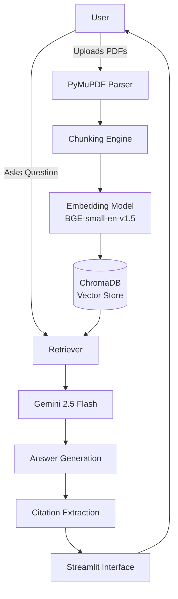

# Architecture Diagram (Mermaid Source)

> Render this on [mermaid.live](https://mermaid.live) or view it directly in
> `README.md`, where it renders automatically on GitHub.

```mermaid
flowchart TD
    A[User] -->|Uploads PDFs| B[PyMuPDF Parser]
    B --> C[Chunking Engine]
    C --> D[Embedding Model<br/>BGE-small-en-v1.5]
    D --> E[(ChromaDB<br/>Vector Store)]
    A -->|Asks Question| F[Retriever]
    E --> F
    F --> G[Gemini 2.5 Flash]
    G --> H[Answer Generation]
    H --> I[Citation Extraction]
    I --> J[Streamlit Interface]
    J --> A
```
